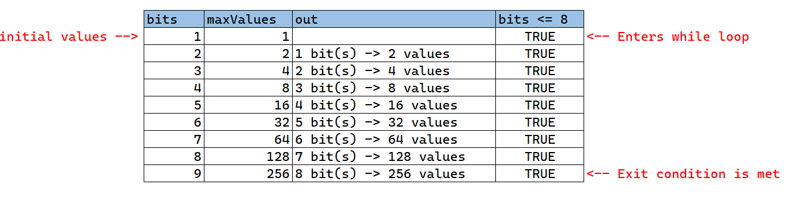
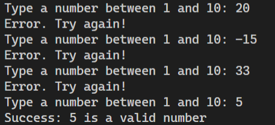

@snap[north span-100]
## Módulo 6
# Ciclos
@snapend

@snap[span-40 south-east]

@snapend

@snap[span-35 south-west]

@snapend

---
@snap[midpoint span-100]
# Ciclos o Loops
@snapend

+++
## Loops
Un bucle / ciclo / loop, es una sección de código diseñada para repetirse. Por lo general, cuenta con tres secciones:
@ol[text-08]
1. @css[text-blue](Cuerpo [Body]): ¿Qué quiero repetir?
2. @css[text-blue](Variable[s] de Control [Control variable]): ¿Qué variable va a controlar la repetición?
3. @css[text-blue](Condición[es] de Salida [Exit condition]): ¿Cuántas veces lo queremos repetir?
@olend

+++
@snap[north-west span-80]
@code[java zoom-08](assets/src/Print5.java)
@snapend

@snap[midpoint span-100 text-08 bg-black text-white fragment]
Ambos programas son equivalentes, pero ¿si quisiéramos imprimir 100 números? ¿Qué modificaciones haríamos a cada uno?
@snapend

@snap[south-east span-80]
@code[java zoom-08](assets/src/Loop5.java)
@snapend

---
@snap[midpoint span-100]
# While
## Ciclos
@snapend

+++
@snap[text-08]
Un ciclo while se va a repetir mientras la expresión boleana entre paréntesis @css[text-blue](bolean_condition) condición se cumpla.  
<br>
Utilizamos la siguiente sintaxis: 
<br>
@snapend

```java
while(boolean_condition){
  //
  //code block to be executed
  //
}
```
<br>
@snap[text-08]
Ejemplos de condiciones:
@snapend

```java
i < 10
keepGoing == true
residuo != 0
```

+++
Ejemplo: Identifica cada componente del ciclo:
- Control variable
- Body
- Exit condition


+++?code=assets/src/SampleLoop.java
@[5-9](El ciclo completo abarca desde la línea 5 a 9.)
@[5](Variable de control: bits.)
@[6-8](Cuerpo del ciclo.)
@[5](Condición: repetir mientras bits sea menor o igual a 8.)
@[5](Condición de salida: bits mayor que 8)

+++
### Prueba de Escritorio

---
@snap[midpoint span-100]
# Do-While
@snapend

+++
## Do-While
El do-while es tipo de ciclo, muy similar al while, con la excepción de que el procesamiento se va a ejecutar **por lo menos una vez**.

La sintaxis es la siguiente:
```java
do {
  //
  //code block to be executed
  //
} while (boolean_condition);
```

+++
@code[java](assets/src/DoWhile.java?lines=5-20)

@[4-12](El ciclo abarca de la línea 4 a la 12.)
@[5-11](El cuerpo del ciclo de la 5-11. Estas instrucciones se repetirán.)
@[12](Condicion: Repetir mientras invalidInput almacene un valor de "true".)
@[12](Condición de salida: Detener la repetición cuando invalidInput almacene el valor boleano "false".)

+++
@snap[span-100 midpoint]

@snapend

---
@snap[midpoint span-100]
# For
@snapend

+++
### For
Los ciclos for generalmente son utilizados para repetir una serie de instrucciones una cantidad de veces fija.

La sintaxis es la siguiente:

```java
for(initialization; boolean_condition; update){
  //
  // code block to be executed
  //
}
```

+++?code=assets/src/ForLoop.java&lines=5-7
@[1-3](Ciclo completo)
@[1](int i = 9 <-- Inicialización. Se declara una variable que sólo existe dentro del ciclo.)
@[1](i>=0 <-- Condición. Mientras esta condición se cumpla,el ciclo for continuará ejecutándose.)
@[1](i = i-2 <-- Al final de cada ciclo, está operación se ejecutará, reduciendo el valor de "i" en "2". )

+++
@snap[north-west span-50]

@snapend

@snap[east span-100 h3-blue text-07 text-left]
<br><br><br><br>
### Parrot Salute
En el zoológico de Monterrey hay un cotorro muy educado que saluda a cada grupo de personas que pasan. Lee del teclado el tamaño de un grupo, e imprime un saludo por cada persona.
Toma en cuenta lo siguiente:
- Los grupos no pueden ser de menos de 0 personas.
- Los grupos no pueden ser de más de 10 personas.
@snapend
+++

@code[java zoom-07](assets/src/ParrotSalute.java)

---
@snap[midpoint span-100]
# Errores
@snapend

+++
## Errores en Java
Un programa de Java puede tener tres tipos de errores:
@ol[text-08]()
  1. Sintaxis
  2. Ejecución (Runtime)
  3. Lógica
@olend
@snap[south-east span-50]

@snapend
+++
## Errores de Sintaxis
@snap[text-08]
Son errores en la estructura del código fuente. Pueden ser palabras mal escritas, llaves no cerradas, paréntesis incompletos, etc. Generalmente estos errores @css[text-blue](son detectados por el compilador).
@snapend

```java
System.out.println(Hola mundo); //Text should be between " 

int i //Missing ;

int j = 1.56; //int variables cannot hold decimal values

String s1;
System.out.println(s1); //String has not been initialized
```
+++
@snap[text-08 h3-blue]
### Errores de Ejecución (Runtime errors)
Estos errores surgen durante la ejecución de un programa, en donde algun dato o operación generan algun problema.
@snapend

```java
int a = 1;
int b = 0;
int division = a / b; //Divide by zero exception!

int i = Scanner.nextInt(); //User types "a"

String s1 = "abcdef";
char c = s1.charAt(s1.length()); //String index out of range: 6
```

+++
## Errores de Lógica
@snap[span-100 text-08]
Estos errores se originan por defectos inyectados por el programador. El programa no funciona de la manera esperada en alguno o todos los casos.

En los ciclos, hay errores como:
@ol[text-blue](false)
1. Off by one
2. Infinite loops
3. Wrong boolean expressions
@olend

Estos errores son más difíciles de encontrar, pues requiere que entendamos la intensión, el código y el programa que estamos evaluando.

@snapend

+++
```java
// off by one... prints only "hol"
String s1 = "hola";
int len = s1.length() - 1;
for (int i = 0; i < len; i++) {
  System.out.print(s1.charAt(i));
}
```
+++
```java
//i is never updated, so this loops infinitely
while(i < 10){
  System.out.println(i);
}

// wrong condition i<0, causing an infinite loop
for (int i = 10; i>0; i++){
  System.out.println(i);  
}
```